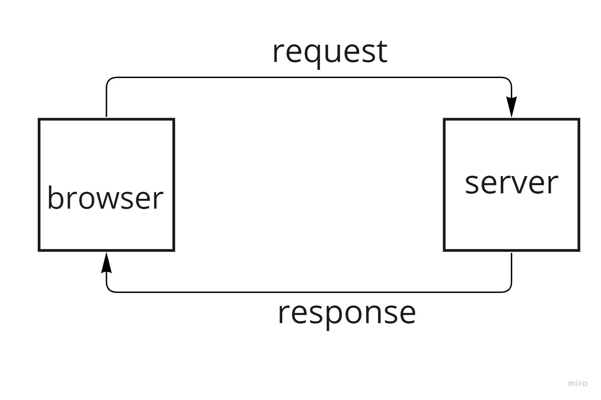
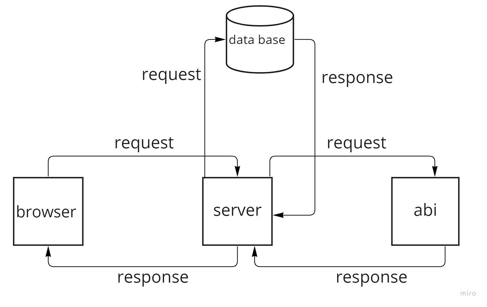

# Movies-Library # Version 1.0

**Author Name**: Mereen Mryan

## WRRC

## Overview

We will build a movie app that can check the latest movies based on categories.
## Getting Started

1. require the package
2. create an Express app
3. the server is listening on port 3000
4. creating a route:app.METHOD(PATH, HANDLER)
5. functions

## Project Features

1. Home Page Endpoint: /
a. Create a route with a method of get and a path of /. The callback should use the provided JSON data.
b. Create a constructor function 
2. Favorite Page Endpoint: “/favorite”
3. Handle errors
a. Create a function to handle the server error (status 500)
b. Create a function to handle "page not found error" (status 404)